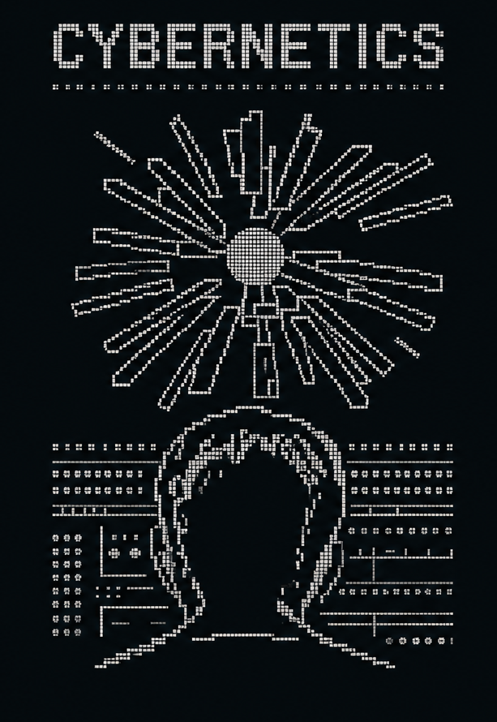

<table border="0">
<tr>
<td valign="top">



</td>
<td valign="top">


```text
> SHORYA RAWAL
  building infrastructure for intelligent systems._


// Research focus
  -> compilers & language design
  -> ai infrastructure / mlsys
  -> systems programming 


// projects
  -> rxv6          rust os, xv6-inspired
  -> emberc        c-to-wasm compiler, rust
  -> toy_scheme    scheme compiler, frontend->codegen
  -> fasm_server   web server in flat assembler

// tools
  Rust . C/C++ . Go . Python . LLVM/MLIR
  Linux . Harness Engineering . Machine Learning 
  Deep Learning . LLMs . VLMs . ALMs

```

[](https://shoryarawal.dev)
[](https://github.com/ShoryaRawal)
</td>
</tr>
</table>

<br>

<div align="center">

[](https://github.com/ShoryaRawal)
[](https://github.com/ShoryaRawal)
[](https://github.com/ShoryaRawal)
[](https://github.com/ShoryaRawal)
[](https://github.com/ShoryaRawal)

</div>
